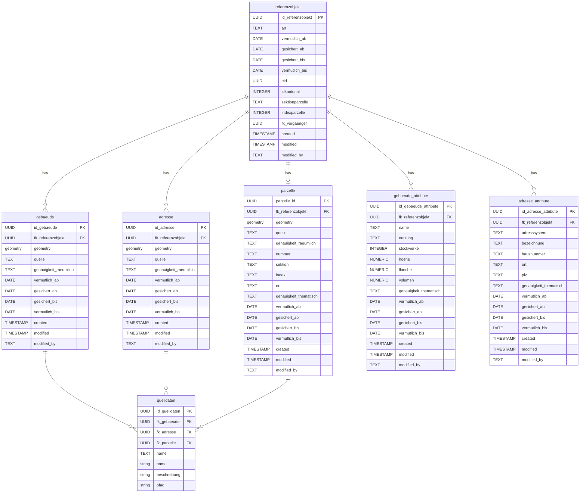
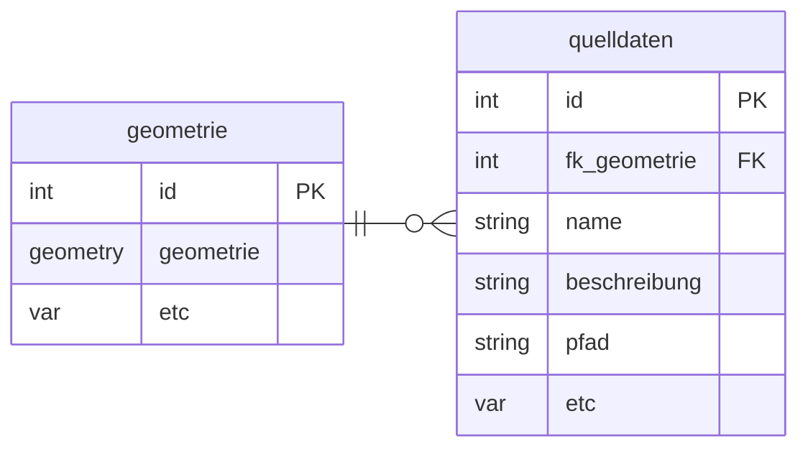
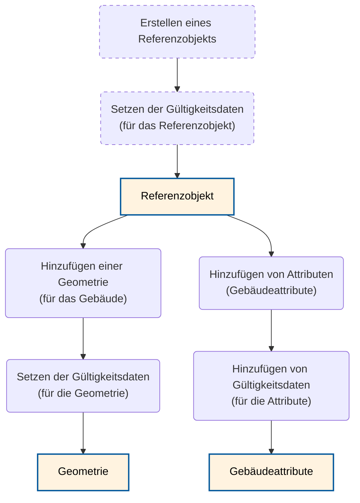
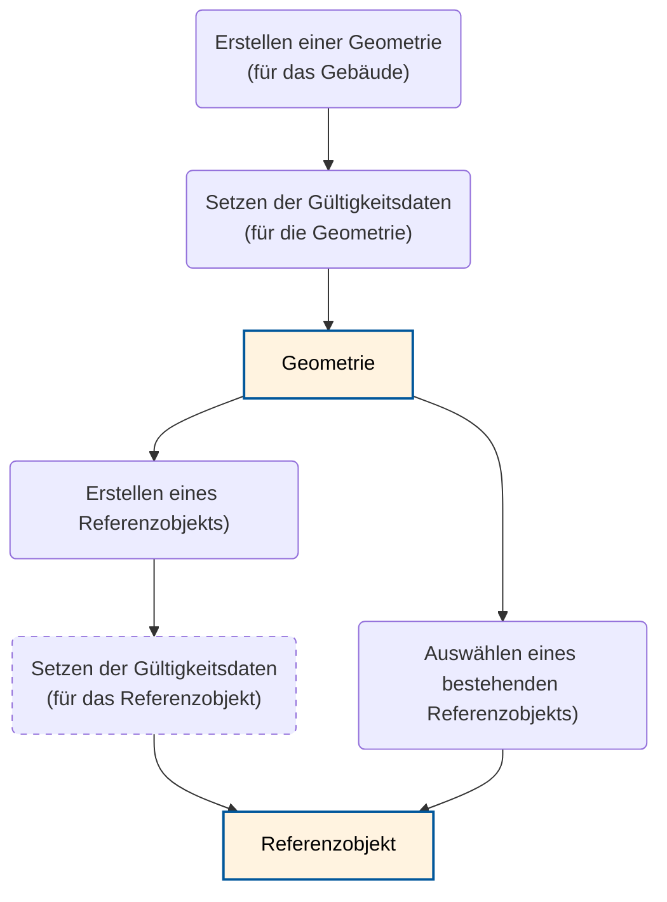

# ch.bs.urkataster

## Datenmodell 

### Änderung der Kardinalität

Die Kardinalität ist im ERM des Konzepts zwischen den Geometrie- oder auch Attributobjekten zu Referenzobjekte ist 0..1 zu 1, währenddem in der Studie einerseits eine 1 zu n Beziehung beschrieben ist (6.4.1). Dies ist wird ebenso mit den Lebenszyklen impliziert (6.3.3) Bei Gebäude und auch Adressen "Solange sich die Lage der Adresse auf denselben Gebäudeeingang bezieht und sich nur geringfügig verändert, sollte das Referenzobjekt bestehen bleiben." Denn da sollen ja wohl noch beide Punkte erfasst bleiben. Bei Parzellen hingegen würde eine 1 zu 1 Beziehung funktionieren, da immer ein neues Referenzobjekt erstellt wird bei einer Änderung der Geometrie.

### Datenquellen (Raster)

Im Kickoff wurde entschieden, dass die Datenquellen (Raster) nicht im Urkataster abgespeichert werden und schon gar nicht die Geometrien davon abhängig sein sollen.

Vorgschlagen wird, dass dennoch optional Infos zu Quellen hinzugefügt werden können.

Heisst eine n zu n Beziehung zwischen Geometrie, wobei das zu einer Komplexität führt, die vermieden werden kann (zBs. beim Löschen einer Geometrie). Folglich würden wir Vorschlagen eine folgende Beziehung zu bauen:

### UUIDs als PKs

Es werden konzequent UUIDs als PKs verwendet (bei einer Umsetzung mit INTERLIS, werden die als OID verwendet - und in der Datenbank dann dennoch Serielle t_ids erstellt).

## Workflows

### Plugin Workflow

#### 1. Starte mit Referenzobjekt

Erstellen des Referenzobjekts oder auch Aufbau auf einem bestehenden:

#### 2. Starte mit Geometrie

Erstellen einer Geometrie:

Weiter bei Bedarf bei 1.