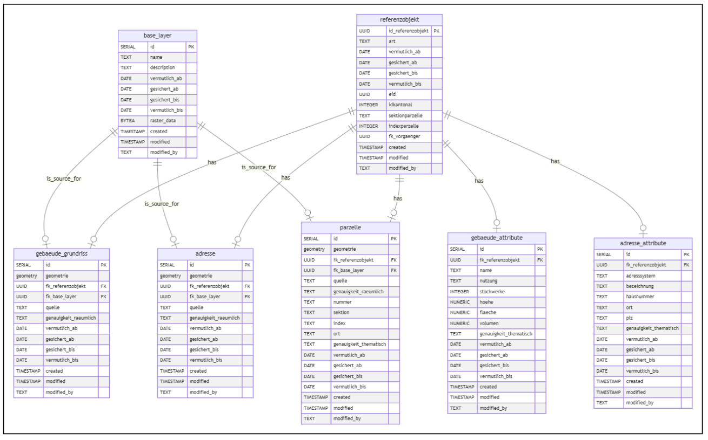
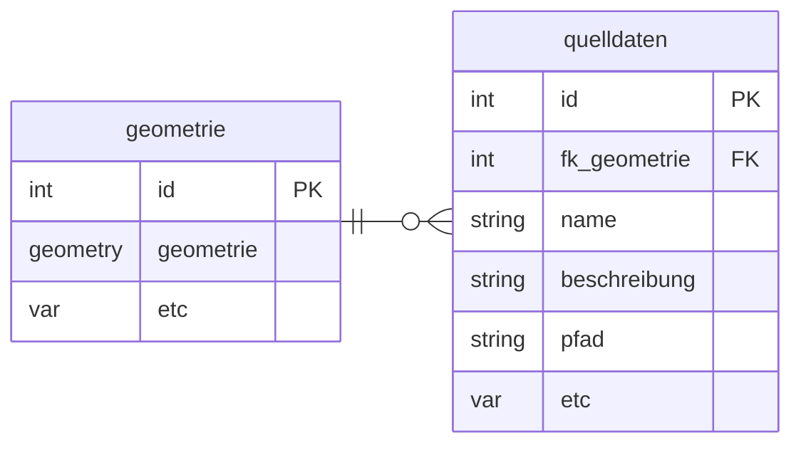
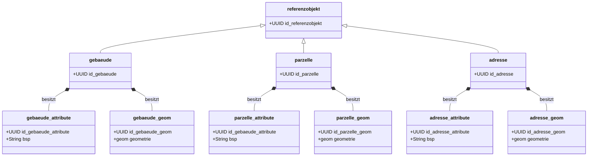
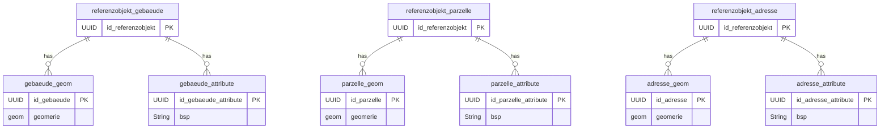
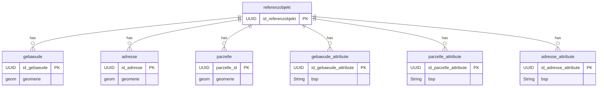
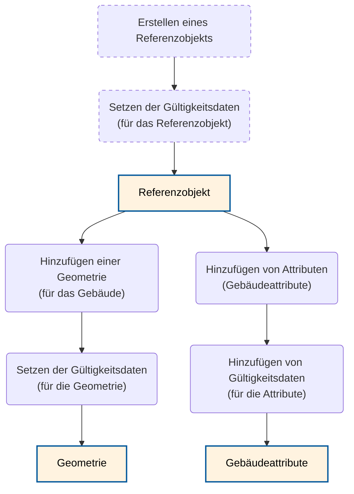
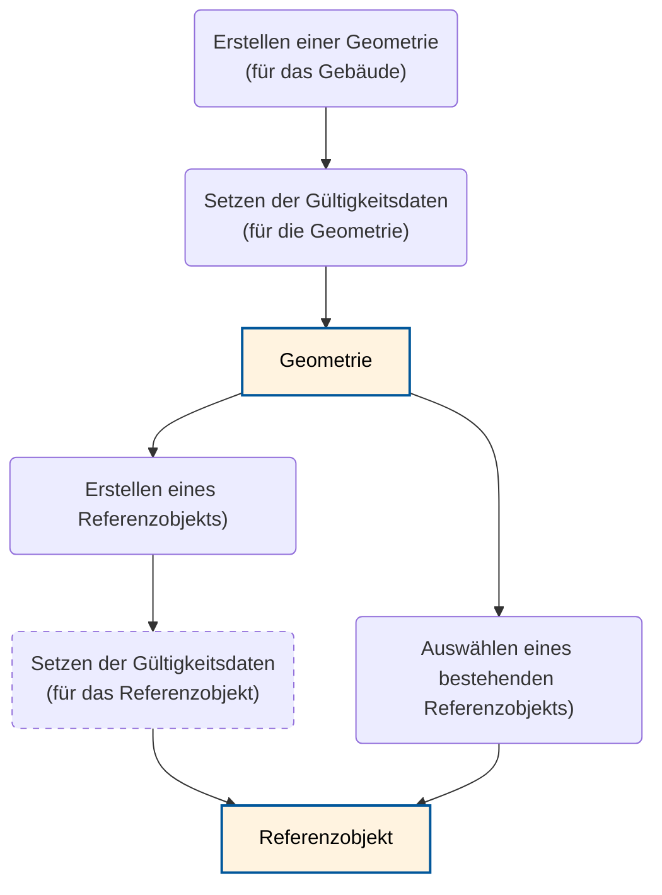

# Konzept und Umsetzung

Dieses Dokument enthält Notizen zur Umsetzung des Projektes.

## Datenmodell 

### Alt

### Neu

Siehe [hier](../database/README.md)

### Datumsfelder und Geometrie des Referenzobjekt

Die Datumsfelder des Referenzbojekts sollen eigentlich den Minimal- und Maximal-Werten der Child-Objekte entsprechen. Ebenso wäre eine Geometrie des Referenzobjekt (das die Geometrien der Child-Objekte zusammenfasst) hilfreich, um die Referenzobjekte geometrisch (visuell) verlinken zu können.
- View auf QGIS: unschön, da man die Erfassung auf einem anderen Layer machen muss
- Generated Columns auf Referenzobjekt: nicht möglich, da dies nur für Kalkulationen innerhalb der Tabelle geht
- View: U.U. inperformant und...
- Materialized View: ... ohne INSTEAD OF kann nicht geupdated werden
- Triggerfunktion: Halt triggerfunktion, ansonsten aber stabil...
Deshalb entschieden wir uns für die Triggerfunktion. Das bedeutet es gibt noch ein Geometriefeld auf dem Referenzobjekt. Bedeuted zwei, damit wir eine stabilere Lösung haben (Punkt für Adresse und Polygon für Adresse).

### Änderung der Kardinalität

Die Kardinalität ist im ERM des Konzepts zwischen den Geometrie- oder auch Attributobjekten zu Referenzobjekte ist 0..1 zu 1, währenddem in der Studie einerseits eine 1 zu n Beziehung beschrieben ist (6.4.1). Dies ist wird ebenso mit den Lebenszyklen impliziert (6.3.3) Bei Gebäude und auch Adressen "Solange sich die Lage der Adresse auf denselben Gebäudeeingang bezieht und sich nur geringfügig verändert, sollte das Referenzobjekt bestehen bleiben." Denn da sollen ja wohl noch beide Punkte erfasst bleiben. Bei Parzellen wurde ebenfalls diese Systematik appliziert, auch wenn es evtl. meistens nur eine Parzelle pro Referenzobjekt hat.

Ebenso wurde das Referenzobjekt optional. Auch wenn thematisch jede Geometrie oder jedes Attributset zu einem Referenzobjekt gehört, würde ansonsten die Datennachführung verunmöglicht werden, da momentan erst Geometrien ohne Referenzobjekte existieren. UPDATE: Wurde wieder entfernt. Nicht optional: Bei Neuerstellung der Geometrie soll halt auch immer ein Referenzobjekt dazu erstellt werden. Und beim Import sollen pro Geometrie ein Referenzobjekt erstellt werden.

### Datenquellen (Raster)

Im Kickoff wurde entschieden, dass die Datenquellen (Raster) nicht im Urkataster abgespeichert werden und schon gar nicht die Geometrien davon abhängig sein sollen.

Vorgschlagen wird, dass dennoch optional Infos zu Quellen hinzugefügt werden können.

Heisst eine n zu n Beziehung zwischen Geometrie, wobei das zu einer Komplexität führt, die vermieden werden kann (zBs. beim Löschen einer Geometrie). Folglich würden wir Vorschlagen eine folgende Beziehung zu bauen:

Es sollen auch Quelldaten für die Attribute verlinkt werden können.

### UUIDs als PKs

Es werden konzequent UUIDs als PKs verwendet (bei einer Umsetzung mit INTERLIS, werden die als OID verwendet - und in der Datenbank dann dennoch Serielle t_ids erstellt).

### Vorgänger Referenz

Der fk_vorgaenger referenziert auf das Vorgänger RO. Das heisst es bräuchte eine rekursive Beziehung. Doch im Meeting mit Jan und Andi kam auf, dass  es auch mehrere Vorgänger haben könnte (wenn sich zBs. eine Fläche teilt). Deshalb soll es eine m zu m beziehung sein.

### Idee mit Vererbung

Wird im Moment davon abgesehen.

### EID wird TEXT

### Bezeichung auf Referenzobjekt

Da zBs. ein Gebäudename auf Gebäude Attribute nur für eine bestimmte Zeit stimmt (und es kann ja merhere pro Referenzobjekt haben).

#### Modellierung
Mit Vererbungen sähe es so aus:

#### Implementierung

Könnte dann so in der DB realisiert werden.

Im Vergleich zur aktuellen Implementierung:

## Workflows Erfassung / Bearbeitung (R05, R06, R07)

### Plugin Workflow

#### 1. Starte mit Referenzobjekt

Erstellen des Referenzobjekts oder auch Aufbau auf einem bestehenden:

#### 2. Starte mit Geometrie

Erstellen einer Geometrie:

Weiter bei Bedarf bei 1.

### Anzeige (R08, RO9, R10, R11)

#### Zeitliche Einschränkung

Es wird nur gefordert, die Geometrie zeitlich zu filtern (auch nur das wurde offeriert). Dennoch könnte es vielleicht sinnvoll sein, auch die Attribute und Referenzobjekte zeitlich zu filtern. Dafür müsste man wohl einen Layerfilter bauen, der über einen selbstgebauten Slider sich je nach dem anpasst.
