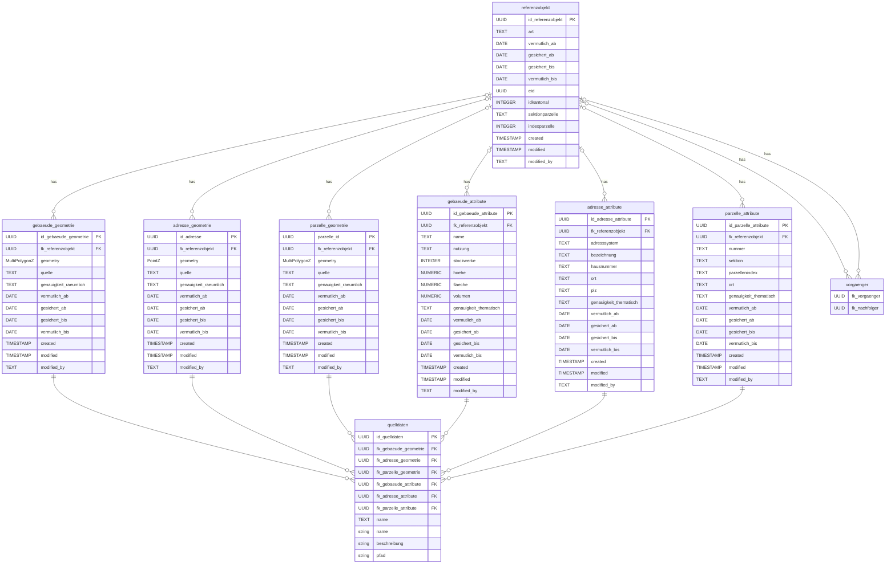

# Datenbank

## Erstellen des Schemas

```bash
psql -h localhost -p 54322 -U docker -d gis -f create_schema.sql
```

## Erstelle Demodaten
```bash
psql -h localhost -p 54322 -U docker -d gis -f demodaten.sql
```

## Datenmodell


