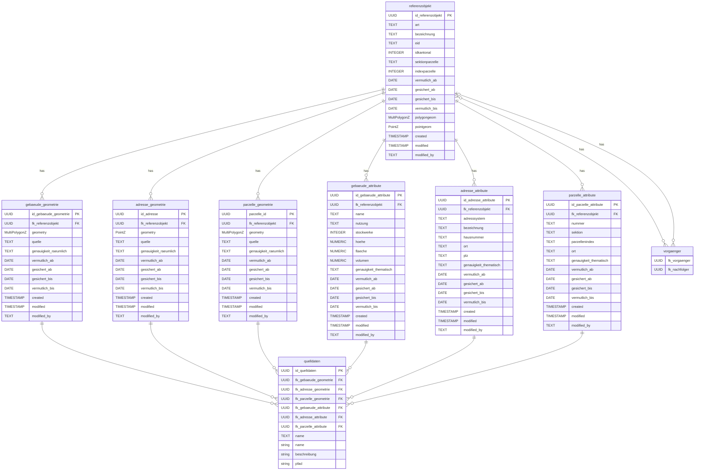

# Datenbank

## Erstellen des Schemas

```bash
psql -h localhost -p 54322 -U docker -d gis -f create_schema.sql
```

## Datenmodell


### Triggerfunktion

Wenn ein Feld vermutlich_ab, vermutlich_bis, gesichert_ab, gesichert_bis in...
... gebaeude_geometrie oder ...
... adresse_geometrie oder ...
... parzelle_geometrie oder ...
... gebaeude_attribute oder ...
... adresse_attribute oder ...
... parzelle_attribute ...
... angepasst (oder auch ein neues Objekt hinzugefügt) wird, dann passe auch den Parent referenzobjekt (fk_referenzobjekt) die gleichnamigen Datumswerte anhand Maximum und Minimum der Children an.

Wenn ...
... gebaeude_geometrie oder ...
... parzelle_geometrie ...
... in Geometrie angepasst (oder auch ein neues Objekt hinzugefügt) wird, dann passe auch den Parent referenzobjekt in polygeom an, damit es alle Geometrien der Children als ST_Multi(ST_Union vereint.

Wenn ...
... adresse_geometrie ...
... in Geometrie angepasst (oder auch ein neues Objekt hinzugefügt) wird, dann passe auch den Parent referenzobjekt in pointgeom an, damit es alle Geometrien der Children als ST_Multi(ST_Union vereint.

Wenn ...
... referenzobjekt ...
... neu erstellt wird, kann es in unserer Lösung sein, dass bereits Child Objekte bestehen (zBs. aufgrund der Transaktion: RO Form öffnen, Geom erfassen, Geom schliessen (Trans Position 1), RO schliessen (Trans Positition 2)), deshalb soll es die Geometrien und Dates der Child-Objekte finden

## Erstelle Demodaten

### Generated Data 

Erstellt einfach Random Daten irgendwo (für Lasttest evtl.)

```bash
psql -h localhost -p 54322 -U docker -d gis -f demodaten/demodaten-generated.sql
```

### Realdaten

Beispieldatensatz erhalten von Andreas in demodaten/testdaten-real-shp

Was ich gemacht habe um es zu importieren. Es gibt 3 Graphical Modelle im Projekt.

1. Fixe Dummy-Referenzobjekte erstellt für alle Typen (schreibe dummy in bezeichnung)
2. Die UUIDs in Modell statisch als FK eingetragen beim Refactor Algorithmus
3. Modelle ausgeführt
4. Script ausgeführt, um die Referenzobjekte zu erstellen anhand von Überschneidungen (für Gebäude)
    ```bash
    psql -h localhost -p 54322 -U docker -d gis -f demodaten/testdaten-real-shp/scripts/referenzobjekte_gebaeude.sql
    ```
5. Script ausgeführt, um die Referenzobjekte zu erstellen pro Adresse (auch wenn nicht optimal)
    ```bash
    psql -h localhost -p 54322 -U docker -d gis -f demodaten/testdaten-real-shp/scripts/referenzobjekte_gebaeude.sql
    ```
6. Script ausgeführt, um genau ein Referenzobjekt zu erstellen pro Parzelle und die ParzNr (die in quelle drin ist) übernommen
    ```bash
    psql -h localhost -p 54322 -U docker -d gis -f demodaten/testdaten-real-shp/scripts/referenzobjekte_parzellen.sql
    ```
7. Dummy-Referenzobjekte gelöscht
8. Da in quelle der parzelle_geometrien und in bezeichnung der referenzobjekte mapping info reingeschrieben wuren, kann das noch bereinigt werden

### Realdaten mit SQL Dump

Für erneutes erstellen, dump importieren.
```bash
psql -h localhost -p 54322 -U docker -d gis -f demodaten/testdaten-real-shp/dump/data-dump.sql
```