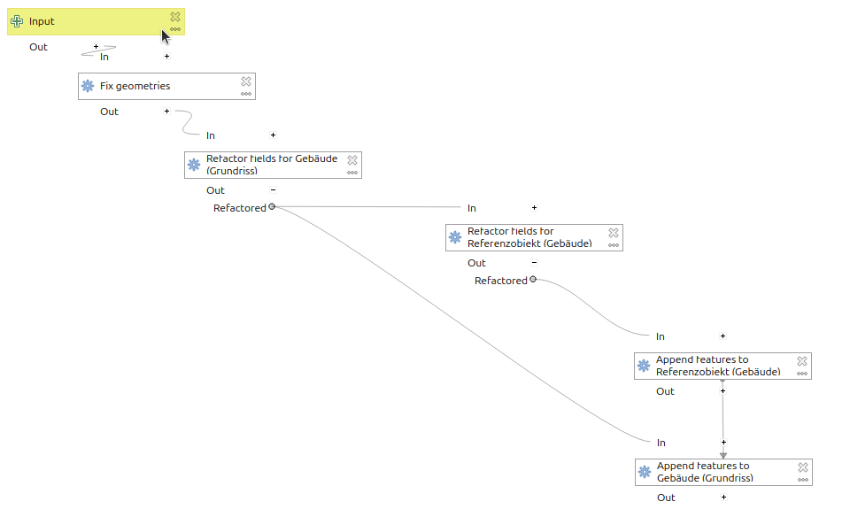

# Import

Aktuell sind im QGIS Projekt Modelle enthalten um Shape Files in die betreffenden Layer zu importieren.

Man kann ein Shapefile auswählen, die Geometrien und die Von- und Bis-Datum werden übernommen und in den betreffenden Geometrielayer importiert. Dazu wird pro Geometrie ein Referenzobjekt erstellt und verlinkt.

Es kann sein, dass es nicht in der automatischen Transaktion funktioniert (je nach QGIS Version). Wenn du aber den Transaktionsmodus zwischenzeitlich deaktivierst, sollte es klappen:

*Projekt > Eigenschaften... > Datenquellen* und dort den Transaktionsmodus auf "Lokaler Bearbeitungsbuffer".

## Technische Details

Mit Rechtsklick auf das Modell und "Bearbeiten" öffnet sich der Modeller, wo man den Workflow mit den einzelnen Steps anschauen und bei Bedarf bearbeiten kann:

# Export

To do