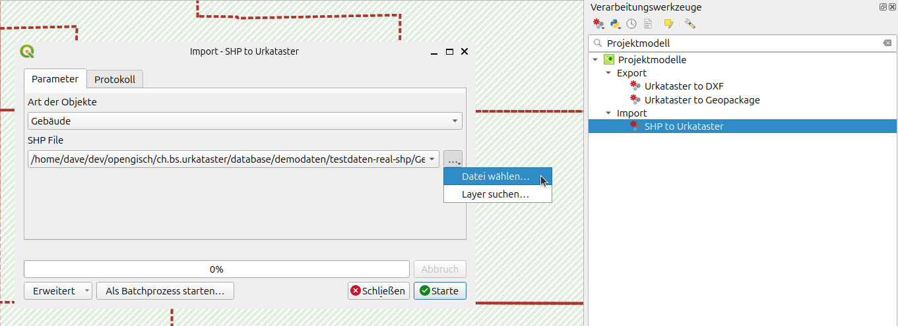
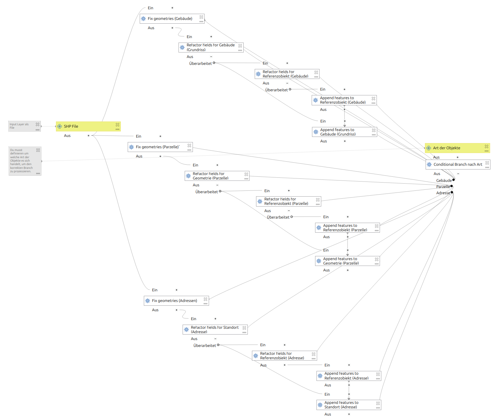
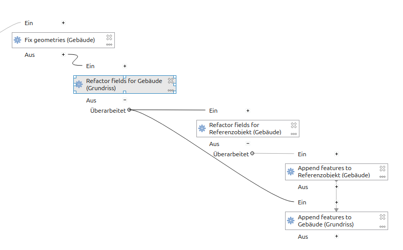
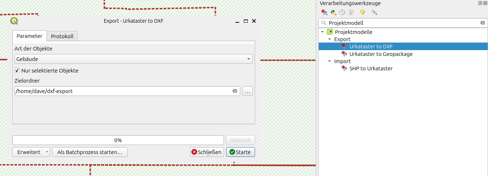
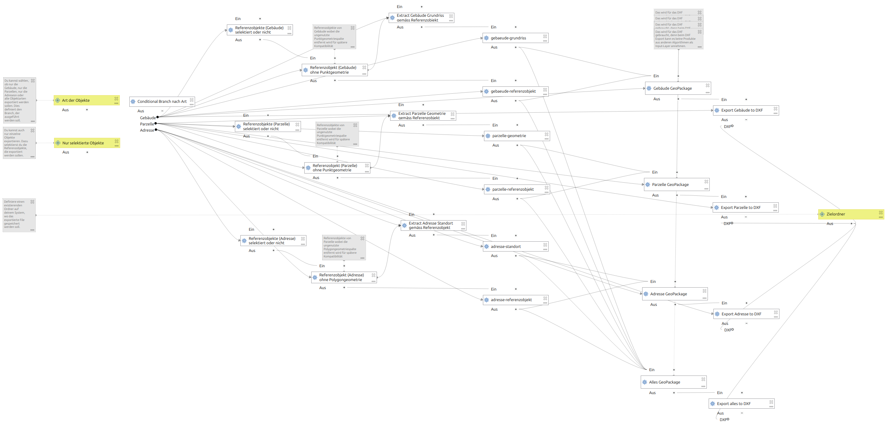

# Import

Im QGIS Projekt ist eine Modell enthalten, um Shape Files in die betreffenden Layer zu importieren.

Es lässt sich über die Verarbeitungswerkzeuge starten, oder auch über *Projekt > Models*

Man kann ein Shapefile auswählen, die Geometrien und die Von- und Bis-Datum werden übernommen und in den betreffenden Geometrielayer importiert. Dazu wird pro Geometrie ein Referenzobjekt erstellt und verlinkt.

**Achtung:** Es kann sein, dass es nicht in der automatischen Transaktion funktioniert (je nach QGIS Version). Wenn du aber den Transaktionsmodus zwischenzeitlich deaktivierst, sollte es klappen:

*Projekt > Eigenschaften... > Datenquellen* und dort den Transaktionsmodus auf "Lokaler Bearbeitungsbuffer".

## Technische Details

Das ganze Modell sieht so aus.

Das Modell enthält die drei Branches für die drei Objektarten. Deshalb ist es so gross. Neben den Input- und Outputparametern ist der Ablauf für Gebäudeobjekte folgendermassen.

1. **Fix Geometries** Da einige Geometrien nicht geschlossen sind, werden sie soweit das geht geflickt.
2. **Refactor fields for Gebäude (Grundriss)** Die Felder der Objekte werden gemappt, damit sie auf den Geometrie-Layer *Gebäude (Grundriss)* applizierbar sind. Weiter werden auch UUIDs für den Primary- und Foreignkey (zum Referenzobjekt) erstellt. Ausserdem werden einige invalide Datumseinträge für Monat / Tag auf 01 gesetzt.
3. **Refactor fields for Referenzobjekt (Gebäude)** Pro Geometrieobjekt wird ein Referenzobjekt (mit der Foreignkey-UUID des Geometrieobjektes als Primarykey) erstellt. Ausserdem werden einige invalide Datumseinträge für Monat / Tag auf 01 gesetzt.
4. **Append features to Referenzobjekt (Gebäude)** Objekte werden dem Referenzobjekt-Layer hinzugefügt.
5. **Append features to Gebäude (Grundriss)** Objekte werden dem Geometrie-Layer hinzugefügt.

Je nach Branch (Gebäude, Parzelle oder Adresse) werden artenspezifische Attribute berücksichtig.

# Export

Im QGIS Projekt sind Modelle enthalten, um die Daten als GeoPackage oder DXF zu exportieren.

## Funktionsweise

### Zeitraum der exportiert wird

Aktuell wird alles exportiert, das gefiltert wird und - je nach dem - selektiert ist. Das heisst, man setzt den Zeitraum im Toolbar-Slider, die Objekte werden dementsprechen gefiltert und folglich nur dieser Zeitraum im Export berücksichtigt.

### 2. Art der zu exportierenden Objekte

Du kannst wählen, ob nur die Gebäude, nur die Parzellen, nur die Adresesn oder alle Objektarten exportiert werden sollen.

### 3. Nur selektierte Objekte exportieren

Du kannst auch nur einzelne Objekte exportieren. Dazu selektierst du die Referenzobjekte, die exportiert werden sollen.

### 4. Zielordner definieren

Definiere einen existierenden Ordner auf deinem System, wo das exportierte File gespeichert werden soll.

## Export nach Geopackage

Das ganze Modell sieht so aus.

Auch dieses Modell ist gemäss Objektarten in drei (bzw. einem vierten für "alle Objekte") Branches aufgeteilt.

1. **Fix Geometries** Da einige Geometrien nicht geschlossen sind, werden sie soweit das geht geflickt.
2. **Refactor fields for Gebäude (Grundriss)** Die Felder der Objekte werden gemappt, damit sie auf den Geometrie-Layer *Gebäude (Grundriss)* applizierbar sind. Weiter werden auch UUIDs für den Primary- und Foreignkey (zum Referenzobjekt) erstellt. Ausserdem werden einige invalide Datumseinträge für Monat / Tag auf 01 gesetzt.
3. **Refactor fields for Referenzobjekt (Gebäude)** Pro Geometrieobjekt wird ein Referenzobjekt (mit der Foreignkey-UUID des Geometrieobjektes als Primarykey) erstellt. Ausserdem werden einige invalide Datumseinträge für Monat / Tag auf 01 gesetzt.
4. **Append features to Referenzobjekt (Gebäude)** Objekte werden dem Referenzobjekt-Layer hinzugefügt.
5. **Append features to Gebäude (Grundriss)** Objekte werden dem Geometrie-Layer hinzugefügt.

Je nach Branch (Gebäude, Parzelle oder Adresse) werden artenspezifische Attribute berücksichtig.

## Export nach DXF