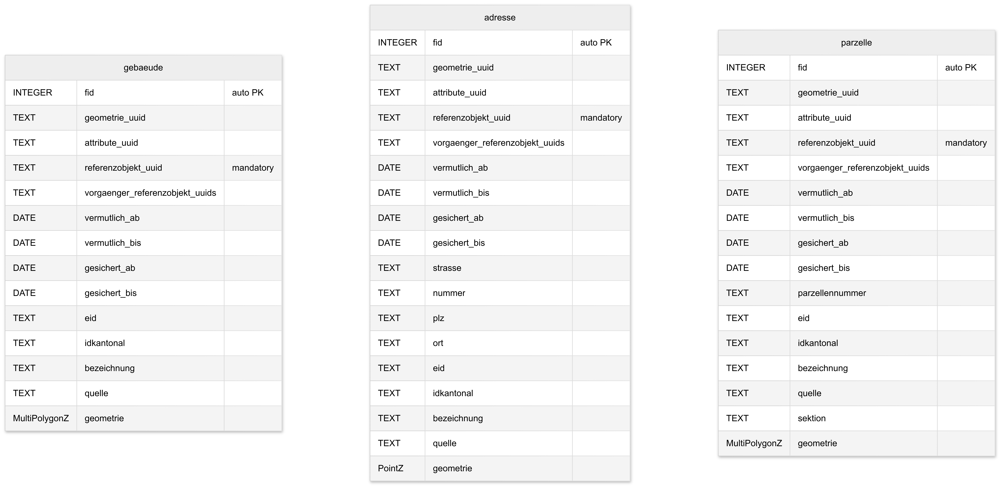
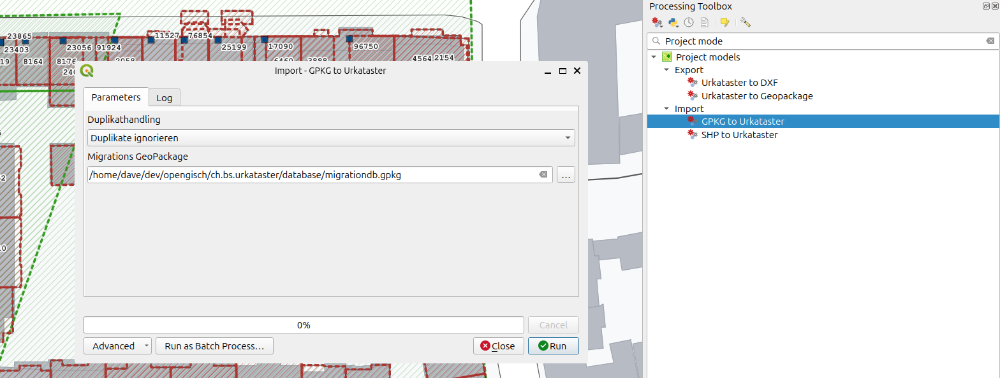
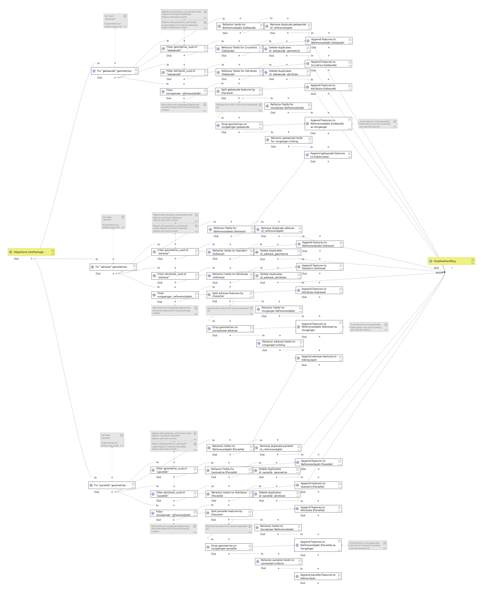
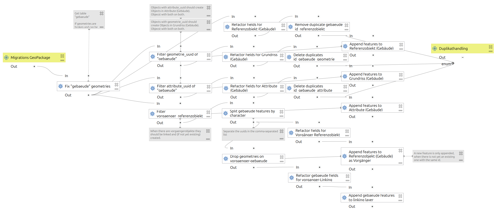
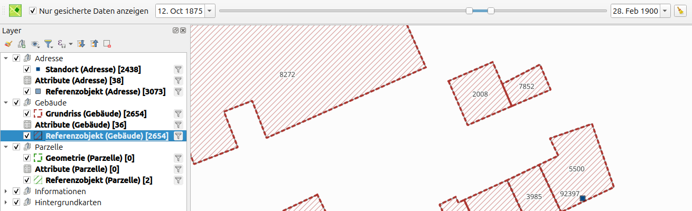
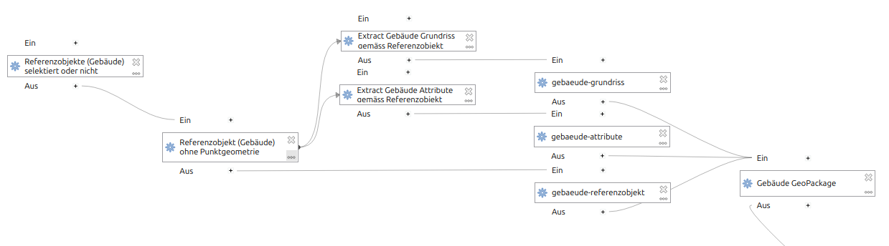

# Import Shape-Files

Im QGIS Projekt ist eine Modell enthalten, um Shape Files in die betreffenden Layer zu importieren.

Es lässt sich über die Verarbeitungswerkzeuge starten, oder auch über *Projekt > Models*

**Achtung:** Es kann sein, dass es nicht in der automatischen Transaktion funktioniert (je nach QGIS Version). Wenn du aber den Transaktionsmodus zwischenzeitlich deaktivierst, sollte es klappen:

*Projekt > Eigenschaften... > Datenquellen* und dort den Transaktionsmodus auf "Lokaler Bearbeitungsbuffer".

## Funktionsweise

Man kann ein Shapefile auswählen, die Geometrien und die Von- und Bis-Datum werden übernommen und in den betreffenden Geometrielayer importiert. Dazu wird pro Geometrie ein Referenzobjekt erstellt und verlinkt.

## Technische Details

Das ganze Modell sieht so aus.

Das Modell enthält die drei Branches für die drei Objektarten. Deshalb ist es so gross. Neben den Input- und Outputparametern ist der Ablauf für Gebäudeobjekte folgendermassen.

1. **Fix Geometries** Da einige Geometrien nicht geschlossen sind, werden sie soweit das geht geflickt.
2. **Refactor fields for Gebäude (Grundriss)** Die Felder der Objekte werden gemappt, damit sie auf den Geometrie-Layer *Gebäude (Grundriss)* applizierbar sind. Weiter werden auch UUIDs für den Primary- und Foreignkey (zum Referenzobjekt) erstellt. Ausserdem werden einige invalide Datumseinträge für Monat / Tag auf 01 gesetzt.
3. **Refactor fields for Referenzobjekt (Gebäude)** Pro Geometrieobjekt wird ein Referenzobjekt (mit der Foreignkey-UUID des Geometrieobjektes als Primarykey) erstellt. Ausserdem werden einige invalide Datumseinträge für Monat / Tag auf 01 gesetzt.
4. **Append features to Referenzobjekt (Gebäude)** Objekte werden dem Referenzobjekt-Layer hinzugefügt.
5. **Append features to Gebäude (Grundriss)** Objekte werden dem Geometrie-Layer hinzugefügt.

Je nach Branch (Gebäude, Parzelle oder Adresse) werden artenspezifische Attribute berücksichtig.

# Import GeoPackage

Die Daten im GeoPackage ((https://github.com/opengisch/ch.bs.urkataster/tree/main/database/migrationdb.gpkg) haben folgende Struktur:

Das Modell heisst `GPKG to Urkataster` und lässt sich über die Verarbeitungswerkzeuge starten, oder auch über *Projekt > Models*

**Achtung:** Es kann sein, dass es nicht in der automatischen Transaktion funktioniert (je nach QGIS Version). Wenn du aber den Transaktionsmodus zwischenzeitlich deaktivierst, sollte es klappen:

*Projekt > Eigenschaften... > Datenquellen* und dort den Transaktionsmodus auf "Lokaler Bearbeitungsbuffer".

## Funktionsweise

am Beispiel der "Gebäude"

### Referenzobjekt

Enthält der Eintrag eine `referenzobjekt_uuid`, die noch nicht vorhanden ist in der Datenbank, wird ein neues Objekt in `Referenzobjekt (Gebäude)` von der Art `gebaeude` erstellt und die WErte für `eid`, `idkantonal` und `bezeichnung` eingetragen.

### Geometrie (Grundriss)

Enthält der Eintrag eine `geometrie_uuid`, die noch nicht vorhanden ist in der Datenbank, wird ein neues Objekt in `Grundriss (Gebäude)` erstellt und die Datumswerte und die Geometrie eingetragen. Ebenso der Link (FK) zum Referenzobjekt, womit sich dann auch Geometrie und Datumswerte des Referenzobjektes anpassen (per Datenbank-Trigger).

### Attribute (Grundriss)

Enthält der Eintrag eine `attribute_uuid`, die noch nicht vorhanden ist in der Datenbank, wird ein neues Objekt in `Attribute (Gebäude)` erstellt und die Datumswerte eingetragen. Ebenso der Link (FK) zum Referenzobjekt, womit sich dann auch Datumswerte des Referenzobjektes anpassen (per Datenbank-Trigger).

### Vorgaenger

Enhält der Eintrag einen Wert in `vorgaenger_referenzobjekt_uuids` (kann eine UUID sein oder eine Liste mehrerer UUIDs kommaspariert), wird:
- geprüft, ob es bereits ein Referenzobjekt mit dieser UUID gibt und wenn nein, wird es erstellt
- in der Linking-Tabelle `vorgaenger` die aktuelle `referenzobjekt_uuid` als Nachfolger-FK eingetragen und eine `vorgaenger_referenzobjekt_uuid` als Vorgänger-FK. Wenn es mehrere `vorgaenger_referenzobjekt_uuids` sind, gibt es auch mehrere Einträge.

### Duplikationshandling

- Wenn man auswählt, dass Duplikate ignoriert werden, werden keine Objekte abgefüllt, derren UUID bereits in der Datenbank ist. 
- Wenn man auswählt, dass Duplikate aktualisiert werden sollen, werden die Attribute (oder auch Geometrie) der vorhandenen Objekte mit gleicher UUID aktualisiert.

## Technische Details

Das ganze Modell sieht so aus (hier für GeoPackage)

Auch dieses Modell ist gemäss Objektarten in drei Teile aufgeteilt, auch wenn immer alle Objektarten importiert werden (keine Branches, wie im Export).

1. **Geometrie Fix** Allenfalls kaputte Geometrien werden geflickt.
2. **Filter Funktionen** Die Objekte werden nun so gefilter, dass wir Referenzobjekte, Geometrieobjekte und Attributobjekte haben.
3. **Refactor Fields** Die Felder müssen nun gemappt werden zu den Namen der Spalten in PostgreSQL, ausserdem müssen Standardwerte abgefüllt werden.
4. **Remove Duplicates** Die Input-Objektlayer werden vorgängig von Duplikaten bereinigt
5. **Append Features** Dann werden die Objekte abgefüllt. Zuerst die Referenzobjekte, erst dann werden die weiteren Schritte ausgeführt (mit Dependency zum nächsten Step: Linie von "Append..." zurück auf "Filter attribute...")
6. **Vorgänger** Die Liste der Vorgänger wird in einzelne Objekte aufgeteilt und die Links werden einzeln abgefüllt. Dabei werden Referenzobjekte vorgängig neu erstellt, derren UUID noch nicht in der Datenbank gefunden werden kann.

# Export

Im QGIS Projekt sind Modelle enthalten, um die Daten als GeoPackage oder DXF zu exportieren.

Es lässt sich über die Verarbeitungswerkzeuge starten, oder auch über *Projekt > Models*

## Funktionsweise

### Zeitraum der exportiert wird

Aktuell wird alles exportiert, das gefiltert wird und - je nach dem - selektiert ist. Das heisst, man setzt den Zeitraum im Toolbar-Slider, die Objekte werden dementsprechen gefiltert und folglich nur dieser Zeitraum im Export berücksichtigt.

### 2. Art der zu exportierenden Objekte

Du kannst wählen, ob nur die Gebäude, nur die Parzellen, nur die Adresesn oder alle Objektarten exportiert werden sollen.

### 3. Nur selektierte Objekte exportieren

Du kannst auch nur einzelne Objekte exportieren. Dazu selektierst du die Referenzobjekte, die exportiert werden sollen.

### 4. Zielordner definieren

Definiere einen existierenden Ordner auf deinem System, wo das exportierte File gespeichert werden soll.

## Technische Details

Das ganze Modell sieht so aus (hier für GeoPackage)

Auch dieses Modell ist gemäss Objektarten in drei (bzw. einem vierten für "alle Objekte") Branches aufgeteilt.

1. **Referenzobjekte (Gebäude) selektiert oder nicht** Je nach Setting werden nur die selektierten Referenzobjekte oder alle Referenzobjekte berücksichtigt.
2. **Referenzobjekte (Gebäude) ohne Punktgeometrie** Die Tabelle der Referenzobjekte enthält zwei Geometrien (eine für die Polygon-Objekte wie Gebäude und Parzellen und eine für die Punkt-Objekte wie Adressen). Da GeoPackage nur eine Geometriespalte pro Tabelle erlaubt, muss die ungenutzte Geometriespalte entfernt werden.
3. **Extract Gebäude Grundriss gemäss Referenzobjekt** Es werden nun alle Objekte des Geometrie-Layers (*Gebäude (Grundriss)*) herausgefiltert, die den Referenzobjekten zugewiesen sind. 
4. **Extract Gebäude Attribute gemäss Referenzobjekt** Es werden nun alle Objekte des Attribut-Layers (*Gebäude (Attribute)*) herausgefiltert, die den Referenzobjekten zugewiesen sind. Dies wird nur für den GeoPackage Export gemacht und nicht für den DXF-Export.
5. **gebaeude-grundriss**, **gebaeude-attribute**, **gebaeude-referenzobjekt** Es werden die Layer erstellt, die dann in das GeoPackage gespeichert werden.
6. **Gebäude GeoPackage** Ein GeoPackage wird erstellt. Je nach dem für eine einzelne Art oder auch ein Gesammtpacket mit allen Arten. Das wird auch für DXF gemacht, da auf der Basis eines temporären GeoPackages ein DXF erstellt wird.
7. **Export Gebäude to DXF** DXF wird erstellt.