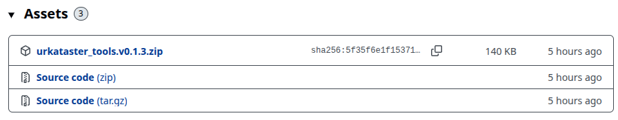
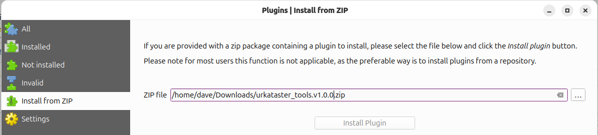
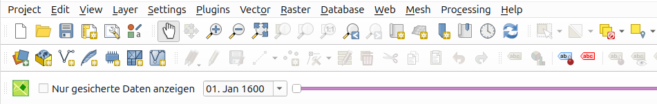

# Installation

## Urkataster Tools Plugin

Das Plugin enthält einerseits das QGIS Projekt, das für den Urkataster verwendet wird, wie auch den Timeslider-Filter.

Lade das Plugin über das Repository herunter https://github.com/opengisch/ch.bs.urkataster/releases



Menu "Erweiterungen" > "Erweiterungen verwalten und installieren..." und dort "Aus ZIP installieren".



Das Plugin enthält eine Abhängigkeit zum Plugin "Append Features to Layer". Dies wird verwendet für das Import-Modell. Falls kein Import gemacht werden soll, kann man diesen Step auch überspringen.

## Datenbank Setup

In deinem PostgreSQL Service File brauchst du den Eintrag `urkataster` mit den Parameter für deine DB.

```
[urkataster]
dbname=meine-urkataster-db
user=docker
password=docker
host=postgres
```

Falls du mehrere DBs hast (zBs. Test- und Produktiv-Umgebung), kannst du auch mehrer Profile in QGIS erstellen und dort das Service File definieren. Menü "Einstellungen" > "Optionen" > "System" > (runterscrollen) "Umgebung", mit "+" neue Umgebungsvariable `PGSERVICEFILE` erstellen.

## Öffnen des Projektes

Das Projekt lässt sich über den Karten-Button öffnen, in der Toolbar ganz links.



Das Projekt kann als das Standardprojekt verwendet werden und bei Bedarf woanderst abgespeichert werden.
