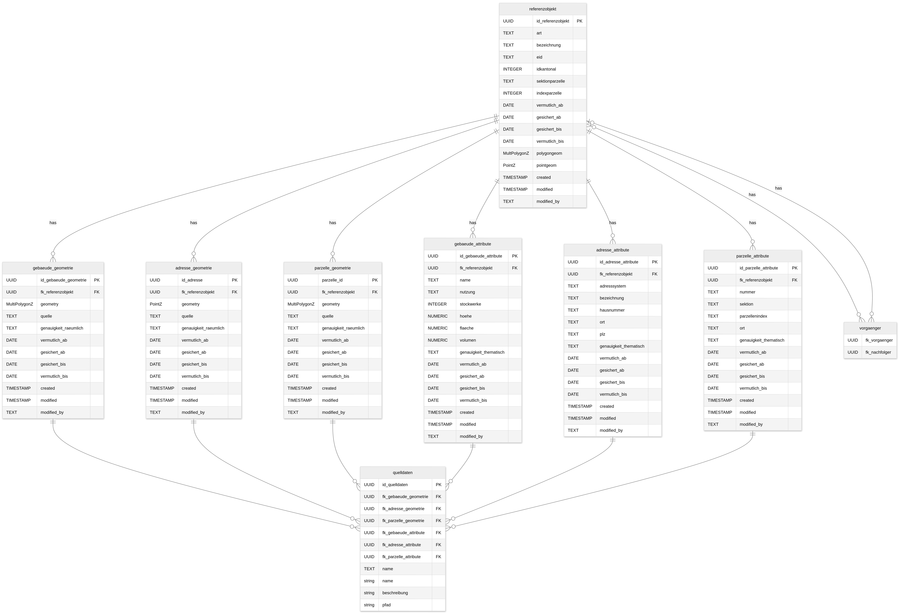

# Source Code und SQL Scripts

Sämmlticher Source Coude und SQL Scripts, sowie technische Informationen und Notizen sind auf dem Github Repository https://github.com/opengisch/ch.bs.urkataster abgelegt und werden neben diesem Dokument als ZIP File publiziert.

## Plugin

Der Plugin Source Code liegt unter "urkataster_tools". Ebenso liegt dort auch das QGIS Projekt, das über das Plugin publiziert wird und im Plugin geöffnet werden kann.

## Datenbank

Infomationen zur Datenbank liegen unter "database". Das Datenmodell und die Funktionsweise der Triggerfunktionen zusätzlich aber folgend.

### Datenmodell

### Triggerfunktion

#### 1. Datum

Wenn ein Feld vermutlich_ab, vermutlich_bis, gesichert_ab, gesichert_bis in...
- ... gebaeude_geometrie oder ...
- ... adresse_geometrie oder ...
- ... parzelle_geometrie oder ...
- ... gebaeude_attribute oder ...
- ... adresse_attribute oder ...
- ... parzelle_attribute ...

... angepasst (oder auch ein neues Objekt hinzugefügt) wird, dann passe auch den Parent referenzobjekt (fk_referenzobjekt) die gleichnamigen Datumswerte anhand Maximum und Minimum der Children an.

#### 2. Geometrien

Wenn ...
- ... gebaeude_geometrie oder ...
- ... parzelle_geometrie ...

... in Geometrie angepasst (oder auch ein neues Objekt hinzugefügt) wird, dann passe auch den Parent referenzobjekt in polygeom an, damit es alle Geometrien der Children als ST_Multi(ST_Union vereint.

Wenn ...
- ... adresse_geometrie ...

... in Geometrie angepasst (oder auch ein neues Objekt hinzugefügt) wird, dann passe auch den Parent referenzobjekt in pointgeom an, damit es alle Geometrien der Children als ST_Multi(ST_Union vereint.

#### 3. Referenzobjekt

Wenn ...
- ... referenzobjekt ...

... neu erstellt wird, kann es in unserer Lösung sein, dass bereits Child Objekte bestehen (zBs. aufgrund der Transaktion: RO Form öffnen, Geom erfassen, Geom schliessen (Trans Position 1), RO schliessen (Trans Positition 2)), deshalb soll es die Geometrien und Dates der Child-Objekte finden.