# Arbeiten mit dem Urkataster

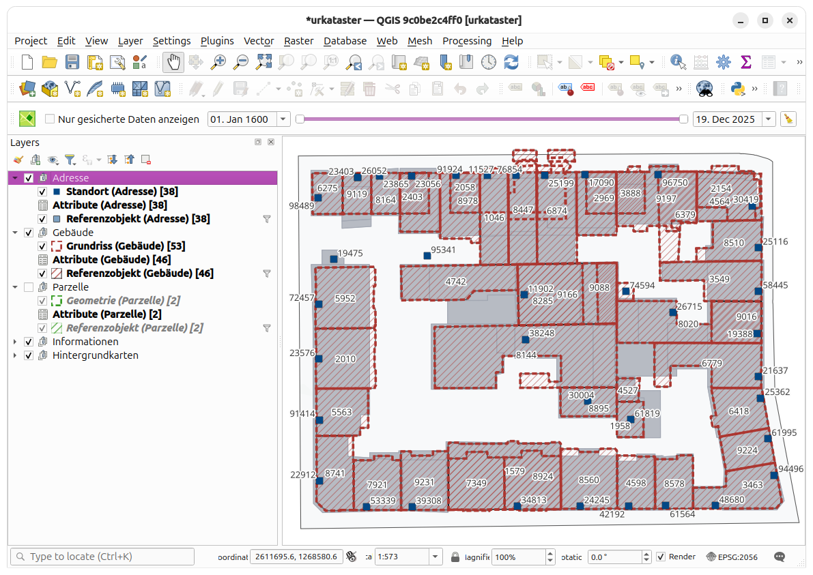

## Projektaufbau

Der Layertree ist - neben Hintergrundkarten und Informationen - in drei Hauptgruppen aufgeteilt:
- Adressen
- Gebäude
- Parzellen

Alle diese Gruppen enthalten drei Layer:
- Geometrien
- Attribute
- Referenzobjekte

## Referenzobjekt, Geometrie und Attribute

Das Referenzobjekt ist die übergeorndete Instanz. Technisch gesehen kann ein Referenzobjekt beliebig viele Geometrien wie auch Attribut-Sets haben.

Referenzobjekte sind alle in der gleichen Tabelle gespeichert. In QGIS aber werden sie nach Art (`adresse`,`gebaeude`,`parzelle`) in die drei Layer aufgeteilt.

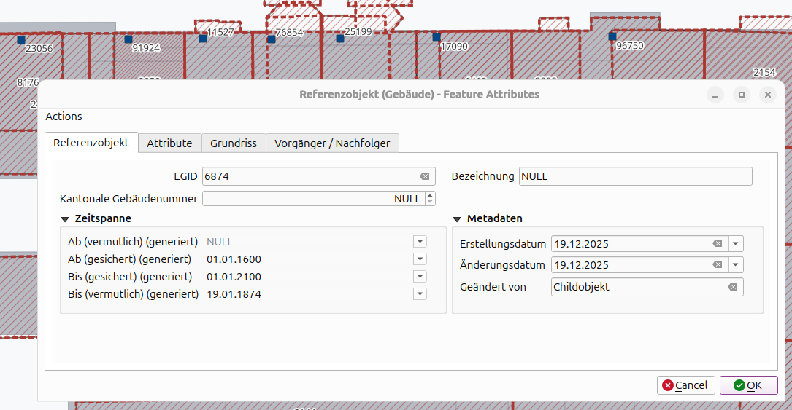

Das Referenzbojekt enhält Attribute wie EID (EGID, EGRID, EGAID), wie auch weitere Informationen. Diese gelten für das Referenzobjekt über seine gesammte Lebensdauer. Da sich die Geometrie des Referenzobjektes über die Zeit verändern kann, können mehrere Geometrien erfasst werden.

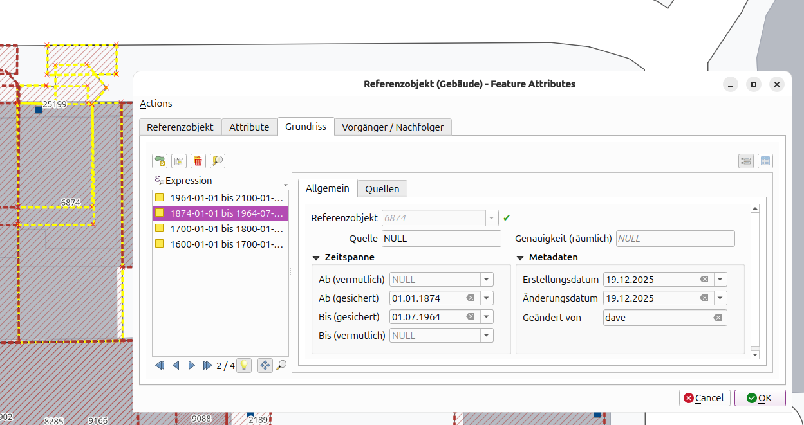

Der Layer "Referenzobjekt" selbst enthält auch eine Geometrie, diese wird aber anhand der verknüpften Objekte des Geometrielayers (hier "Grundriss (Gebäude)") automatisch im Datenbank-Backend berechnet.

Genauso ist es mit den Lebensdauer-Datum. Die sind (wie oben im Screenshot) im Referenzobjekt selbst nicht bearbeitbar. Sie werden aus den minimal und maximal Datum der Geometrie- und Attribut-Objekte kalkuliert.

Auch die Attribute eines Referenzobjekts können über die Zeit ändern, weshalb auch hier mehrere Objekte pro Referenzobjekt erfasst werden können.

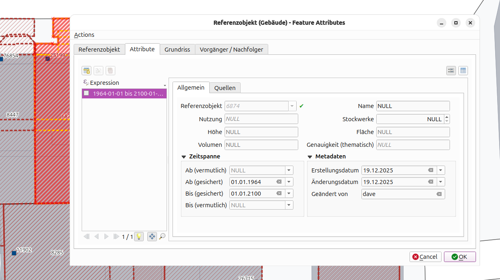

## Geometrie erfassen und verlinken

Um ein Referenzobjekt um eine Geometrie zu erweitern gibt es verschiedene Wege.

### Geometrie zeichnen und Referenzobjekt auf der Karte verlinken

1. Du erfasst die Geometrie. 

    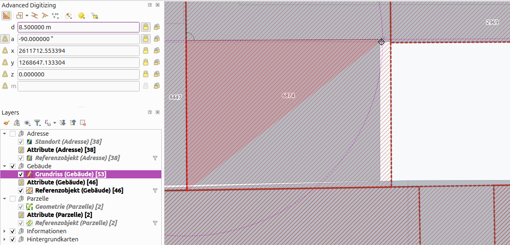
2. Du erfasst die Informationen der Geometrie (wie Datum, Genauigkeit etc.) und linkst sie zum Referenzobjekt indem du das Referenzobjekt auf der Karte auswählst.

    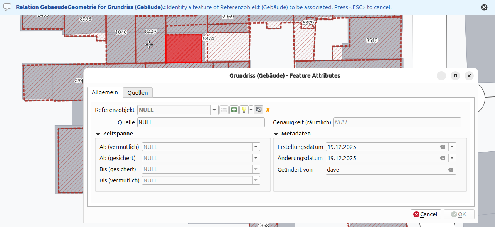

Weiter gibt es auch die Möglichkeit, eine bestehende Geometrie zu duplizieren (oder auch einfach "copy-pasten") und anschliessend anpassen.
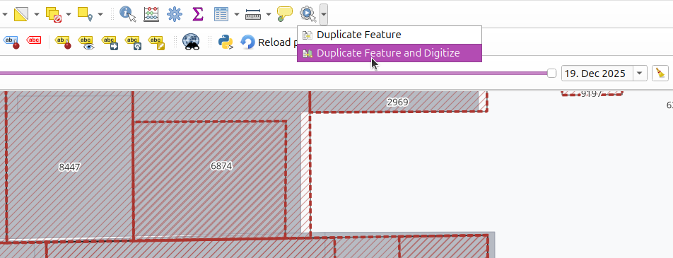

### Geometrie aus Referenzobjekt Formular erfassen

Weiter kann man auch gleich aus dem Formular des Referenzobjektes eine Geometrie erfassen. Diese Möglichkeit scheint intuitiver, aber ist auch etwas umständlicher.

1. Du öffnest das Formular des Referenzobjektes (zum Beispiel über das Identifikationstool).

    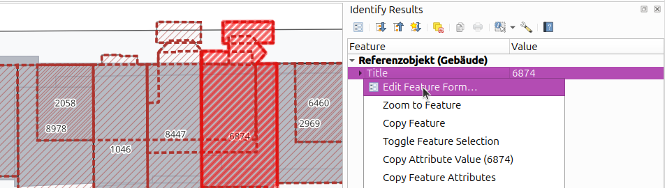
2. Du navigierst auf den Reiter der Geometrien und findest dort auch die Tools, um eine neue Geometrie zu erfassen.

    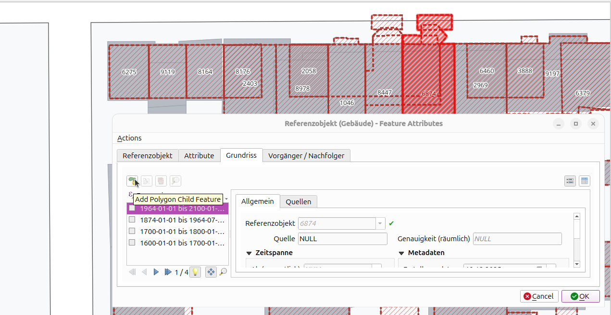
3. Das Formular verschwindet zwischenzeitlich und du kannst die Geometrie erfassen.

    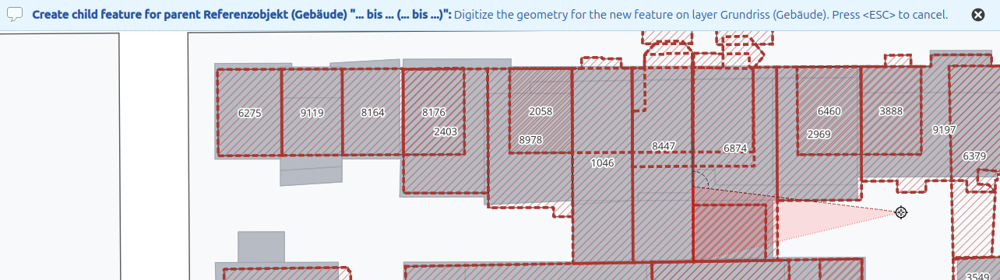
4. Nach Erfassung erscheint das Formular für die Eigenschaften der Geometrie (das Referenzobjekt ist bereits verlinkt)

    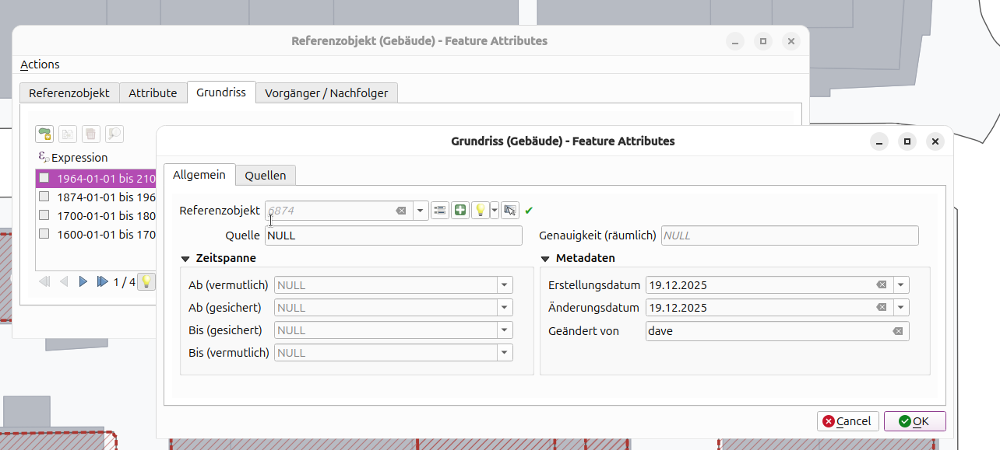
5. Und wird schliesslich zur Liste hinzugefügt.

Weiter gibt es auch hier die Möglichkeit, eine bestzehende Geometrie zu duplizieren. Mit dem betreffenden Button oder auch mit Rechtsklick-Menu auf einem Feature.

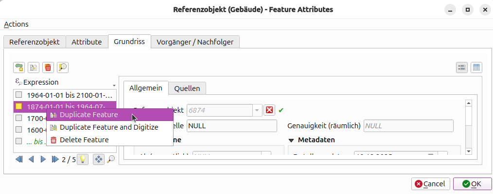

## Attribute erfassen und verlinken

Analog zu den Geometrien gibt es auch die zwei Wege um ein Referenzobjekt um Attribute zu erweitern.

### Attribute hinzufügen und Refernzobjekt auf der Karte zuweisen

1. Du erstellst ein Attribute Objekt.

    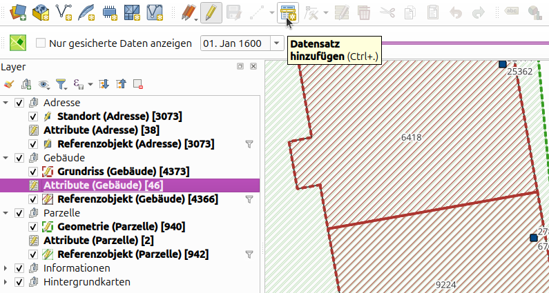 

2. Du erfasst die Informationen wie Parameter (oder auch Datum etc.) und linkst sie zum Referenzobjekt indem du das Referenzobjekt auf der Karte auswählst.

    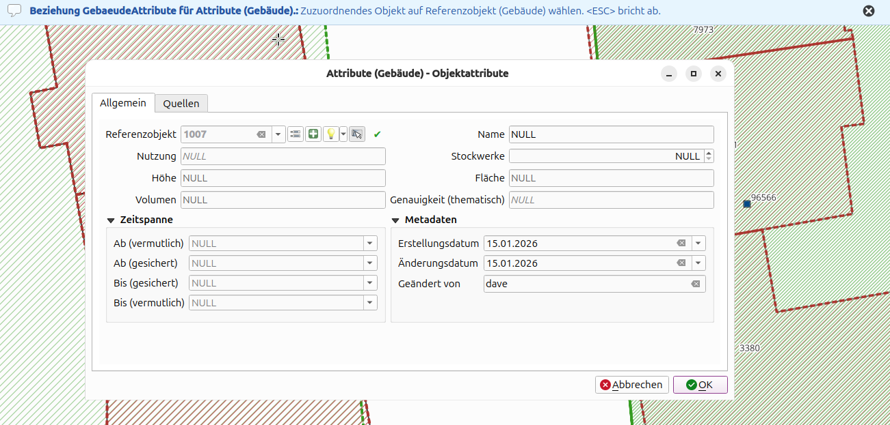

### Attribute aus Referenzobjekt erfassen

Weiter kann man auch hier gleich aus dem Formular des Referenzobjektes ein Attribut-Objekt erfassen.

1. Du öffnest das Formular des Referenzobjektes (zum Beispiel über das Identifikationstool).

    
2. Du navigierst auf den Reiter der Attribute und findest dort kannst du ein neues Attribut Objekt hinzufügen.

    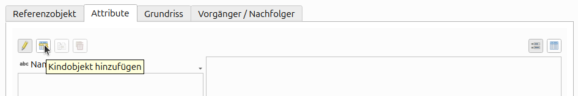

## Objekte Filtern

### Nach Objektart

Um die Objekte nach ihrer Art zu filtern, kann man die betreffenden Gruppe mit der Checkbox sichtbar/unsichtbar geschaltet werden.

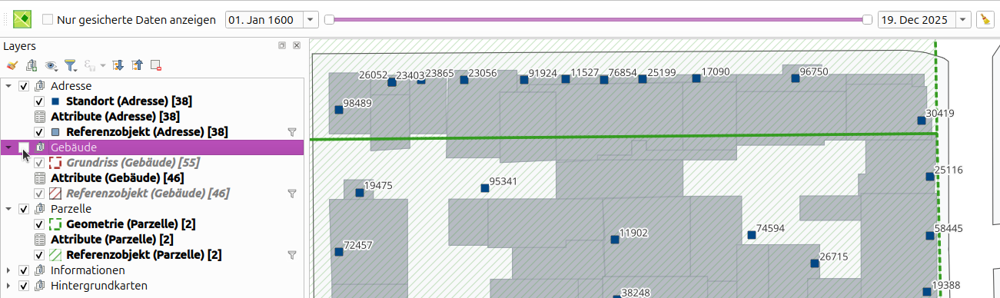

Die Checkbox der Gruppe entscheided über die Sichtbarkeit aller Elemente in der Gruppe. Hier sind Parzellen und Adressen sichtbar, nicht aber die Gebäude.

Wenn man zum Beispiel nur die Gebäude-Grundrisse angezeigt haben möchte, nicht aber die zusammenfassende Geometrie des Referenzobjekt, kann dies auch auf einem einzelnen Layer gemacht werden.

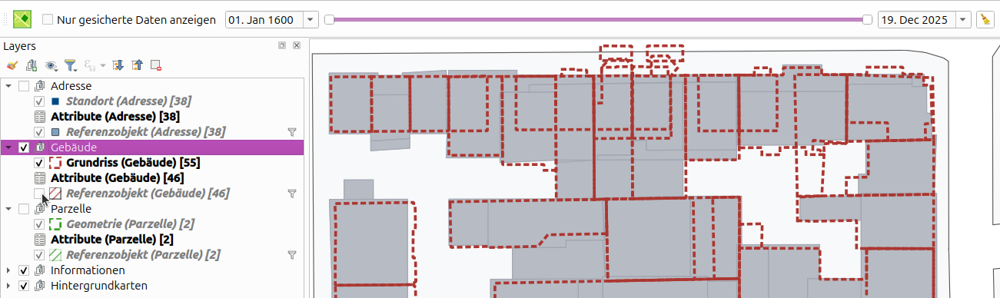

Diese Standard-QGIS Funktion kann auch für die Hintergrundkarten verwendet werden.

### Nach Zeit

Zur Filterung nach Zeit steht der Timeslider in der Toolbar zur Verfügung.

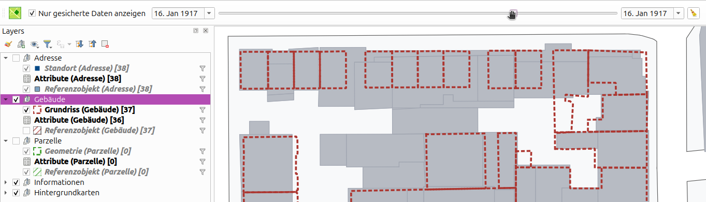

Man kann über die Schalter im Timeslider einen Zeitpunkt auswählen. Die Layer werden dann gemäss diesem Datum gefiltert. Das heisst, wenn das Von-Datum des Objekts kleiner und das Bis-Datum des Objekts grösser als das gewählte Datum ist, wird das Objekt angezeigt. Da der Layer mit einem Query gefiltert wird, werden auch geometrielose Layer (wie die Attribut-Layer) gefiltert. 

Da es zwei Schalter im Timeslider hat, kann man auch ein Bereich wählen.

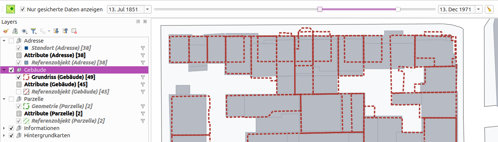

Folglich kann man auch mehrere Zustände visualisieren.

Die Datums-Felder links und rechts des Timesliders zeigen die aktuelle Datumswahl an. Für präzise Eingaben, kann man auch diese Felder editieren (der Timeslider wird entsprechend synchronisiert).

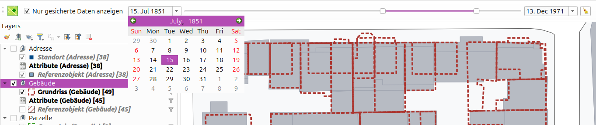

Je nach dem, ob man nur die vermuteten oder gesicherten Datum der Objekte berücksichtigen möchte, kann man das mit der Checkbox auswählen.

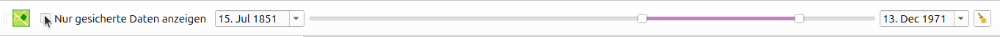

Um die Filter wieder zu entfernen, drückt man den Button ganz rechts.